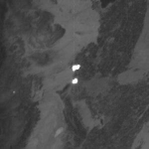
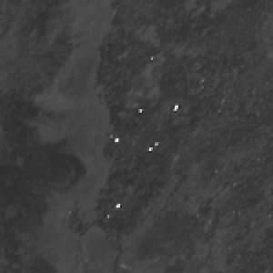
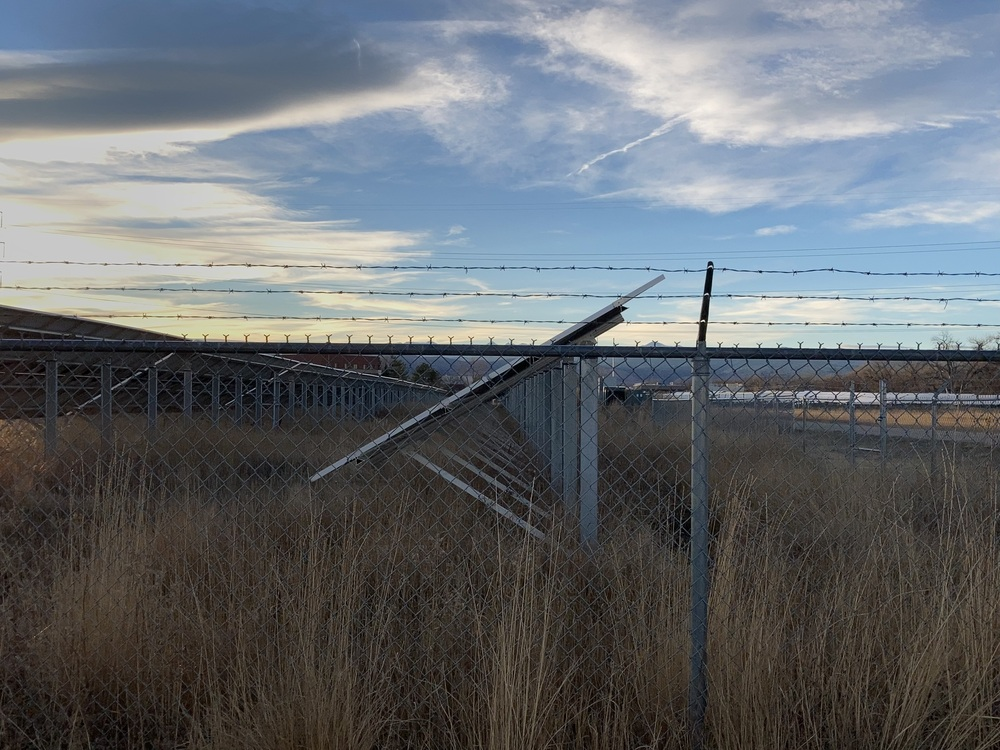
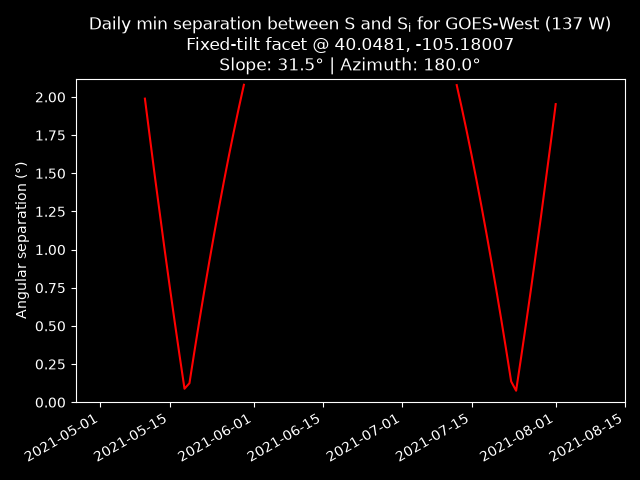
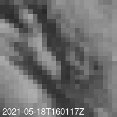
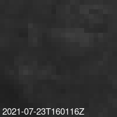

# sparkle-almanac

## Predicting sun glints from tilted facets in a geostationary sensor

### Motivation
Human-made structures periodically reflect sunlight into geostationary Earth observation satellites, causing intense[^1] sun glints that contaminate lightning detections[^2], cloud retrievals, and fire products[^3] [^4]. Static reflection sources include fixed-tilt photovoltaic (PV) power plants, greenhouses, and other angled metal or glass structures. Reflections may also come from solar PV installations that move throughout the day, tracking the Sun either in two axes (altazimuthally) or just one (azimuth). Given the orientation of the facet and/or the number of Sun tracking axes (0, 1, or 2), `SparkleAlmanac` determines the peak times and durations of reflection to mitigate solar contamination.


<p float="left">
    
    
</p>

### Method
The `SparkleAlmanac` algorithm searches for times when the specular lobe of a sun glint would reflect off a facet with known orientation and traverse a geostationary sensor. For reflections from static facets or fixed-tilt solar panels, the slope angle and azimuth of the facet normal can be determined from prior reflection observations or site measurements. If the facet is a dual-axis or horizontal single-axis tracking (HSAT) solar panel, the known tracking axes can substitute for facet azimuth and/or elevation.

#### Determining facet orientation from prior observed reflection
Reflection from the center of the Sun $S$ to satellite $R$ is ideally specular when both incident and reflected rays form the same angle ω with respect to the facet normal $N$:
```math
S+R=2cos(ω)N
```

```math
cos(2ω)=S∙R.
```

<br>

At the moment of ideally specular reflection in the sensor, the facet slope angle $β$ at the half vector $N$ is therefore:
```math
cos(β)=(S_z+R_z)\ /\ 2cos(ω).
```

<br>

The azimuth $γ$ of the facet normal is unambiguously[^5] given by:
```math
γ=atan2(S_y+R_y,\ S_x+R_x).
```

#### Solve for specular Sun position
Given the facet elevation angle $β$ and azimuth $γ$, we uniquely determine a position of the Sun $S_i$ that would cause ideally specular reflection off a facet with normal vector $N$ to a satellite with look vector $R$:
```math
N_x=sin(β)cos(γ)
```
```math
N_y=sin(β)sin(γ)
```
```math
N_z=cos(β)
```

<br>

```math
cos(ω)=N∙R
```
```math
S_i=2cos(ω)N-R.
```

<br>

We assume that dual-axis tracking solar panels always point to the center of the Sun above the horizon. In this special case, $S_i$ is collinear with $R$ and $N$:

```math
S_i=R.
```

#### Search for reflection peaks
From $S_i$, [`FastSparkleAlmanac`](./fast.py) calculates a solar hour angle $LHA$ at the latitude of the facet following algorithm 28 in [^6]. For all days where a solar position $S_i$ is possible, the time of peak reflection between Sun, facet, and satellite is approximated by:

```math
t1=t_n + LHA\ /\ 15°
```

where $t_n$ is the daily solar noon time at the location.

The coarse solution $t1$ is accurate to within ~60 seconds and serves as an initial condition to a bisection that refines the peak time to <1 second. The almanac records the traversal of the Sun near $S_i$ up to +/- 15 minutes from the midpoint time.

<br>

#### Horizontal single-axis tracking (HSAT) solar panels
[`SparkleAlmanac`](./slow.py) iterates over each day in coarse timesteps (minutes), calculating the ideal rotation angle of the HSAT panel following equations 8-10 in [^7]:

```math
r=atan(tan(θ_s)sin(φ_s-γ_a))
```
```math
β=|r|
```
```math
γ=γ_a+asin(sin(r)\ /\ sin(β))
```

where $γ_a$ is the azimuth along the axis of panel rotation, $θ_s$ is the Solar zenith angle, and $φ_s$ the solar azimuth.

At each timestep, we solve for $S_i$ from the current elevation angle $β$ and azimuth of the panel normal $γ$. Times when the Sun approaches $S_i$ are refined and added to the almanac.

## Demo


Solar panel tilt and azimuth angles were measured at a utility PV power plant near Boulder, Colorado US and provided to [`FastSparkleAlmanac`](./fast.py) for GOES-West:



The algorithm correctly predicts two periods of solar declination that support specular reflection into ABI:

<p float="left">


</p>

#### References
[^1]: https://doi.org/10.1117/1.JRS.14.032411
[^2]: https://vlab.noaa.gov/web/geostationary-lightning-mapper/blog/-/blogs/when-the-glm-detects-more-than-lightning
[^3]: https://doi.org/10.1016/B978-0-12-814327-8.00013-5
[^4]: https://doi.org/10.1080/01431161.2023.2217983
[^5]: https://doi.org/10.1016/j.renene.2021.03.047
[^6]: https://microcosmpress.com/vallado/
[^7]: https://www.nlr.gov/docs/fy13osti/58891.pdf
